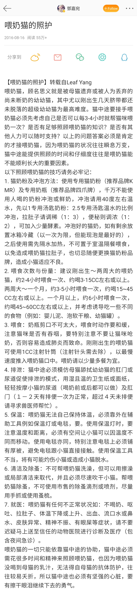

# 喂奶猫的照护
原微博[**@鄧嘉宛**](https://www.weibo.com/u/2638083144?from=feed&loc=avatar)

> 《喂奶猫的照护》 喂奶猫，顾名思义就是被母猫遗弃或被人为丢弃的尚未断奶的幼幼猫，其中尤以刚出生几天脐带都还未脱落的超级幼幼猫为最高难度。

[原文地址](https://www.weibo.com/ttarticle/p/show?id=2309404009111367849932)

**长图片备份,加载卡顿请直接进入原文查看**
