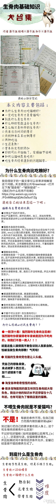
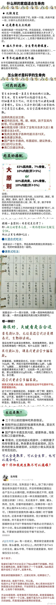
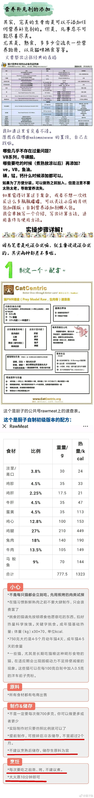
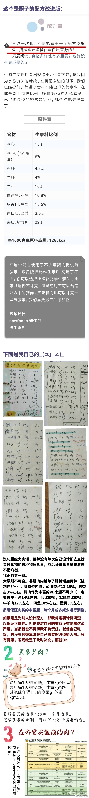
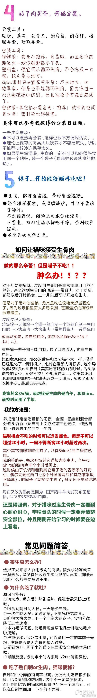

# 生骨肉基础知识大合集
原微博[**@藻子渔**](https://weibo.com/littlemeying)

> 本文主要内容：
> 
> ●为什么生骨肉比吃猫粮好？
> 
> ●一定吃生骨肉才是爱猫吗？
> 
> ●到底什么是生骨肉？
> 
> ●什么样的家庭适合生骨肉？
> 
> ●怎么做才是科学的生骨肉？
> 
> ○肉类冷冻时间的要求
> 
> ○肉的种类及其比例要求
> 
> ○两种吃法
> 
> ○生还是熟？
> 
> ○营养补充剂的添加
> 
> ●好的可以开始做了，实操细节说明
> 
> ●如何让猫咪愿意吃肉？
> 
> ●吃生骨肉经常遇到的问题解答。
> 
> 更多知识移步 @ 生肉怪  的公共号rawmeat。
> 营养添加剂与常用药品表格和肉源表格来自 @ nekomeowww
> 
> 有不足欢迎指出，大家一起学习(๑°3°๑)
> 
> 虽然我只是知识的搬运工，但依旧不得私自转载。
> 打字也是十分消耗ATP的呢。

[原文地址](https://weibo.com/2774494090/H1KEIjH7c?filter=hot&root_comment_id=0&type=comment#_rnd1589166929940)

**分条目查看图片**

**长图片备份,加载卡顿请直接进入原文查看**

