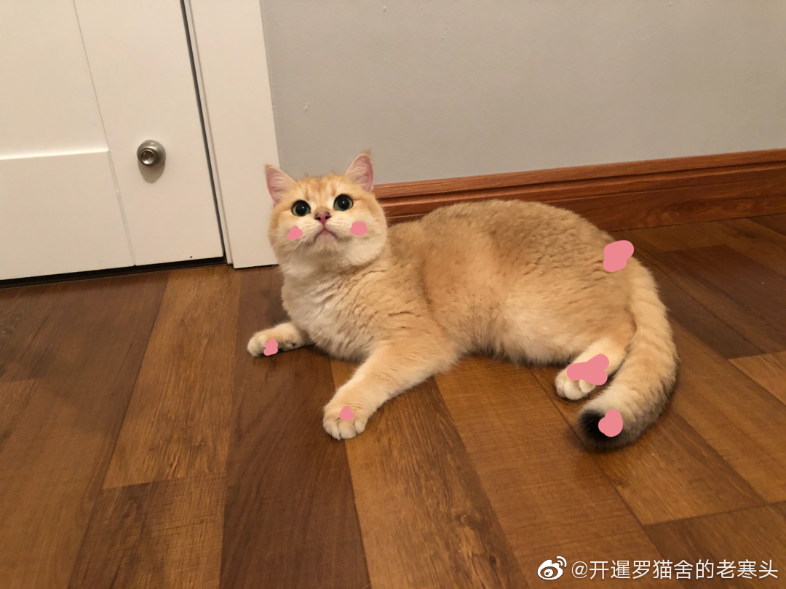
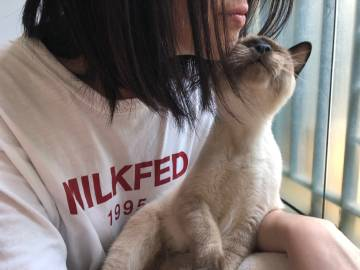
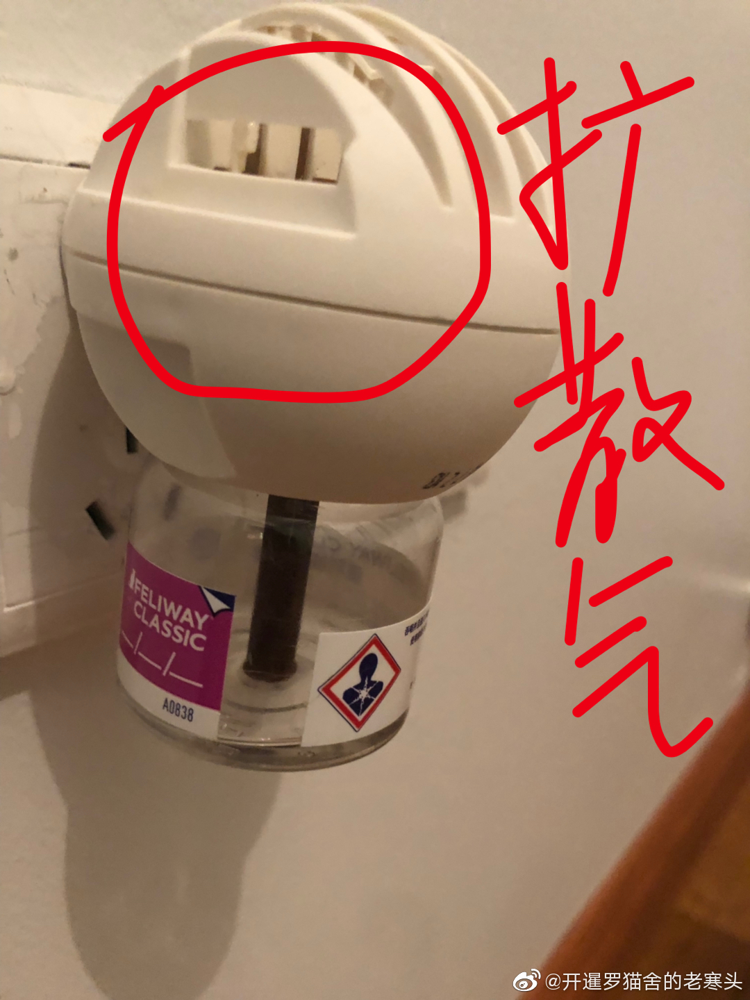

# feliway费洛蒙怎么用
原创[**@开暹罗猫舍的老寒头**](https://m.weibo.cn/detail/4368075983773391)

> 很多人问feliway怎么用？
> 
> 或者我用的根本没用。简单解释一下
> 
> 图1，粉点点是猫自身释放费洛蒙的区域，也是猫咪之间熟悉沟通的方式，仔细观察，猫咪通常会用脸颊去蹭别的猫咪或者你的腿或者头（图2），或者去闻对方的屁屁然后张嘴 傻呆呆地吸着什么， 这些都是在接收对方传达信息的方式。
> 
> feliway是一种合成信息素，仿照猫咪自身散发的信息素去合成出来的，我记忆中是从兔兔身上，不确定。 可以确定是肯定没有任何对身体的副作用，因为不需要器官代谢。 作用就是帮助猫咪缓解紧张的压力，拥有尽可能舒服、放松的状态。
> 
> 图3 是扩散器和香薰，香薰一次够25-30天，我的建议是插上不拔，新猫到家之前三天就插上最好。扩散器如果长期处于使用状态5-6个月可以更换一次，用原厂或者驱蚊香薰的头我觉得没差。
> 
> 最后给的tips
> 
> 覆盖面积官方给的50-70平，我的使用感受20-40平，无遮挡。 扩散器插的位置尽量是猫咪爱待的，低一些，周围不要有遮挡，比如桌子、爬架，这样会使得蒸发出来的油在遮挡物处冷凝，影响扩散效果。 And 尽量减少通风，说白了高浓度的信息素才能被猫咪接收。
> 
> 个人感觉，喷剂对短时间外出没作用，我偶尔会在出去比赛的时候带着，喷航空箱和赛笼还有民宿的房间。 基本上是自我安慰。 建议用法是在插上香薰以后，喷室内空间加强浓度，比如一瓶用完换一瓶的时候。 喷完十分钟放猫进空间。
> 
> 暂时就想到这么多
> 
> 官方给的适用范围
> 
> 1、适应新家（如新幼猫、新猫或多猫家庭）
> 
> 2、新经历（如第一次坐车、第一次梳毛、第一次进入吵闹的环境）
> 
> 3、应激事件（如烟火、暴风雨、节假日、派对）
> 
> 4、猫的居住环境改变（如改造、翻新、装修、搬家）
> 
> 5、访问兽医、寄养
> 
> 6、猫笼运输、旅游
> 
> 7、尿液标记
> 
> 8、领地性磨爪
> 
> 9、应激造成食欲减退
> 
> 10、应激造成正常行为发生改变
> 
> 个人认为13478比较有效，短时间外出没啥用。
> 
> 浓度最重要。
> 
> #家有恶猫##管教恶猫#
> 
> 
> 