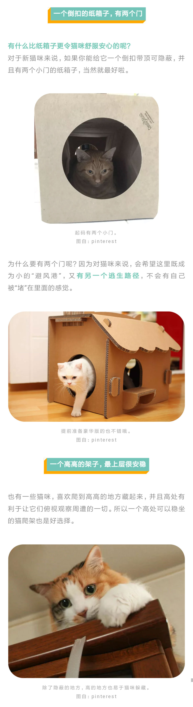
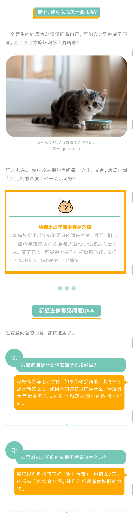

# 新猫害怕怎么办
原微博[**@猫研所CARE**](https://m.weibo.cn/detail/4393241539392014)

> 【新猫到家，躲着不出来，不吃不喝，该怎么办好？】#新猫到家#
> 
> 新猫到家，换了一个全新的环境和新的铲屎官，猫咪这么敏感的小动物，会不会很容易出现应激反应啊？它什么时候才能跟我熟悉起来，投入我们的怀抱呢？
> 
> 别急，只要方法得当，你担心的事情，都会逐一解决的[并不简单]。

**长图片备份,加载卡顿请直接进入原文查看**

