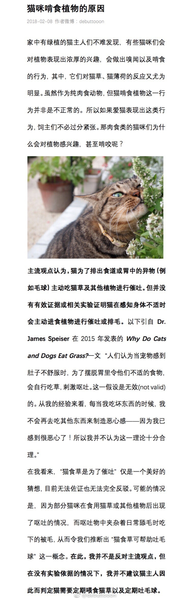
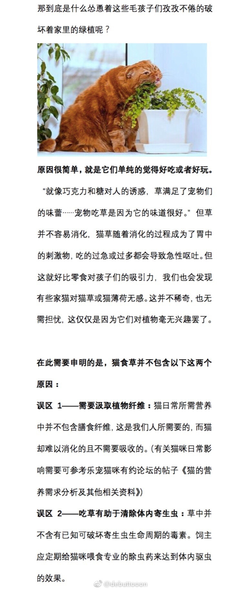
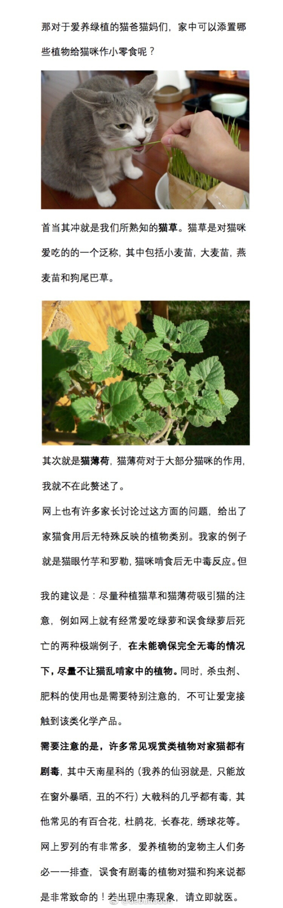
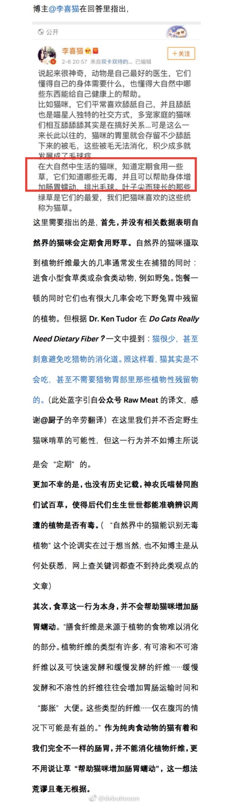
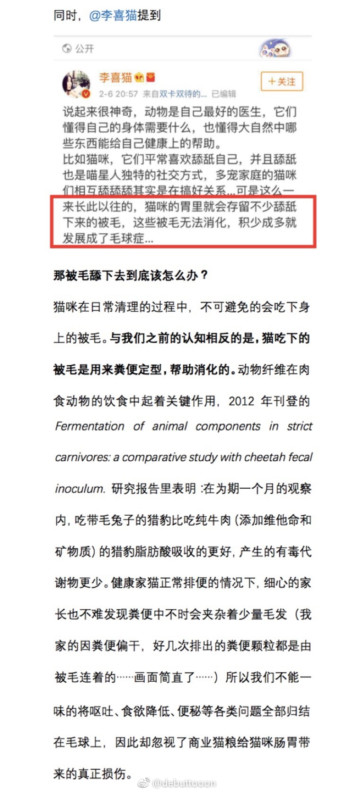
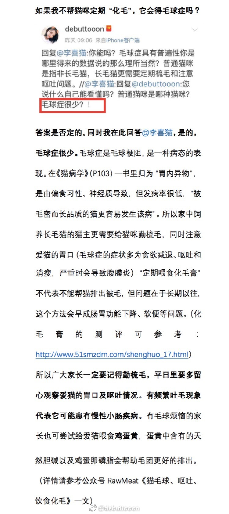
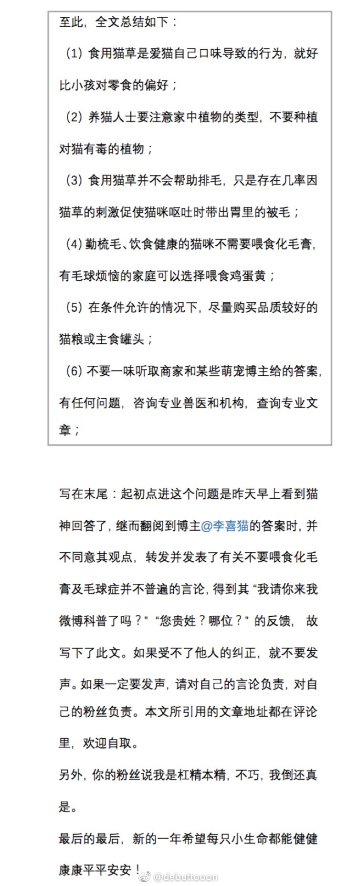
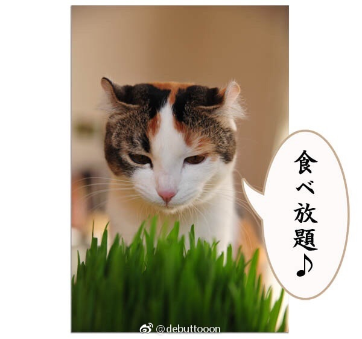
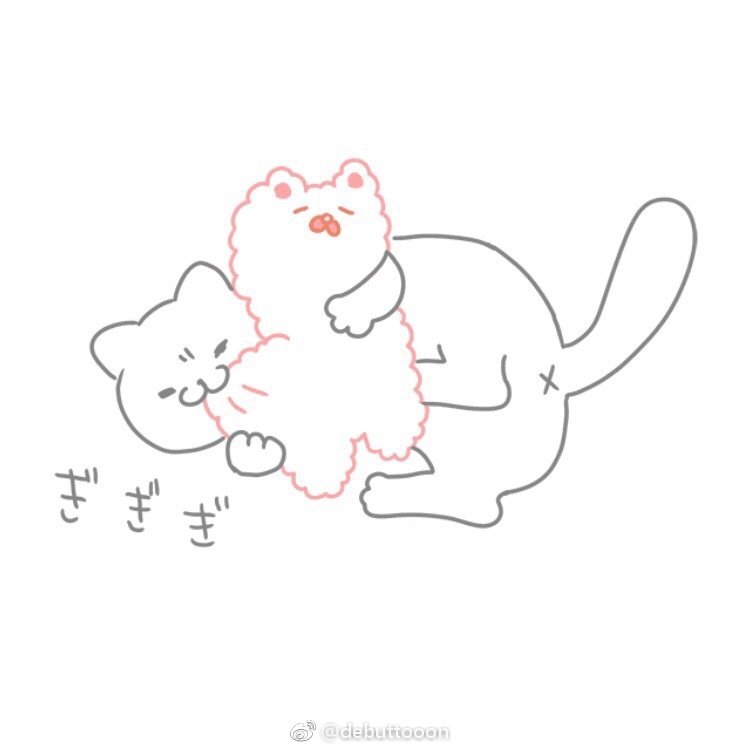

# 猫为何吃草
原微博[**@debuttooon**](https://m.weibo.cn/detail/4205219494034874)
> [为什么有些猫猫狗狗喜欢“啃草”？](https://weibo.com/p/2313474200392790514709/wenda_home?luicode=20000061&lfid=4205219494034874)
> 
> 基于反对博主[@李喜猫](https://m.weibo.cn/u/3295362810) 的回答，反对伪科普，写下此文。相关引用链接会在评论里给出。
> 
> 第一次写回答，文章内容大致包括：猫食草的行为原因，毛球问题以及化毛膏的使用问题。
> 
> 仅为个人拙见，希望能给大家在养猫的问题上提供些建议，欢迎大家给出多方意见，踊跃探讨。

