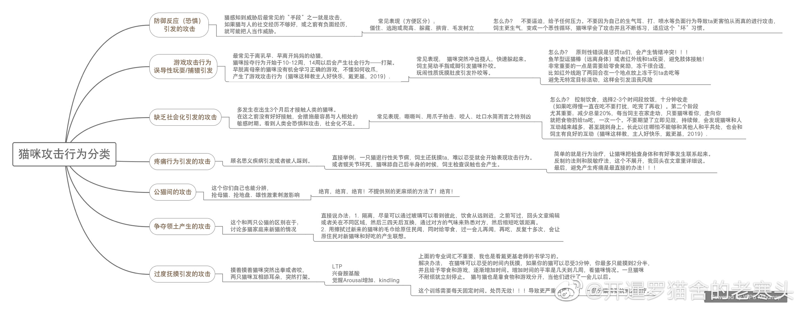

# 猫行为——史上“暂时”最全的猫攻击思维导图！！！ 
原微博[**@开暹罗猫舍的老寒头**](https://m.weibo.cn/detail/4381787893476255)
> 最屌“猫攻击”思维导图！！！ 欢迎转发！欢迎补充！欢迎提问！欢迎夸奖！ 欢迎🍋！
> 
> #管教恶猫##家有恶猫##老寒头的喵#

> ​​首先感谢《猫行为健康和福利》Rodan和Heath，还有《猫咪这样教，主人好快乐》的戴更基老师！还有《家有恶猫》 全季和大光头jackson！我是所有老师知识点的搬运工！
> 
> 不过总结起来也挺费力的，因为知道大家看到一篇一篇的文章有时候读不进去。 觉得思维导图的形式更容易被接受。
> 
> 不看的人怎么都不会看，但希望多一个人对着自己猫的行为看一眼就是这个思维导图的价值。
> 
> 思维导图的优缺点都很明显，优点就不说了。
> 
> 说缺点， 每一个点都很难展开，这个希望大家留言，针对哪个问题细节上需要展开，我在评论里和大家一起讨论，或者单独展开！ 我会邀请@饲养员邓俊 帮助我（虽然不知道他答不答应）
> 
> 另外，母猫的攻击行为还有掠夺的攻击行为以及转向攻击行为还有自发性攻击行为都不在思维导图里。 原因一个是不常见，另一个是越多越复杂。 这些我都找时间补充说明吧！！！
> 
> 大家！！！
> 
> 观察自己的猫咪属于哪种，其实是一件比较困难的事情，需要认真分析，特别防御性攻击和焦虑攻击这些有时候会共有或者转化，在问的时候也需要详细一点说明，不然很难找到正确答案的！！！
> 
> 以上！

